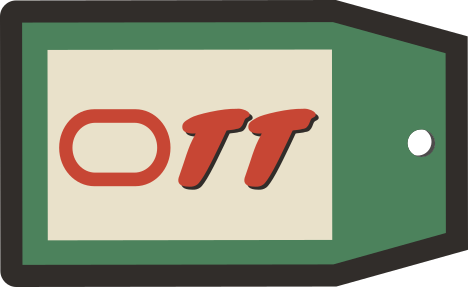

# OCI Tagging Tool README



## Background

Nearly every resource in [Oracle Cloud Infrastructure](https://www.oracle.com/cloud/) can be tagged. Either at
creation time or later. And you set/edit/remove those tags via the console, the CLI, or through the APIs.
 
Read about what/why/how here:

* [Tags in OCI](https://docs.oracle.com/en-us/iaas/Content/Tagging/Tasks/managingtagsandtagnamespaces.htm)
* [Tagging Best Practices (from my buddy Royce)](https://www.ateam-oracle.com/post/oracle-cloud-infrastructure-tagging-best-practices-enable-mandatary-tagging-for-compartments)
* [My blog post on bulk editing tags](https://www.ateam-oracle.com/post/bulk-editing-tags-on-resources-using-the-oci-cli)


## So then what is this and why do I need it?

In my blog post above I mention that the bulk API isn't *super* convenient as it requires JSON inputs and only works on one compartment. This tool simplifies things quite a bit.

It lets you:
* operate on resources **anywhere** in the tenancy
* specify an update to be made to their tags
* see the changes that would be done (i.e. dry run)
* and optionally, actually make those changes

## Command Line options

This tool uses similar command line arguments as many other OCI tools, so it should be familiar to many users.

```
$ ./ott.py
2024-07-26 13:32:53,702 MainThread    INFO ott:<module> -> Parsing command line and configuring...
usage: ott [-h] [-cf CONFIG_FILE] [-cp CONFIG_PROFILE] [-l LOG_FILE] [-d] [-n] [-rg REGIONS] query {set,delete} tag value
ott: error: the following arguments are required: query, action, tag, value

```

| Option           | Meaning                                                                                                |
| -----------      |--------------------------------------------------------------------------------------------------------|
| -h               | Show help                                                                                              |
| -cf CONFIGFILE   | Specify the OCI config file                                                                            |
| -cp PROFILE      | Specify the Profile in the OCI config file                                                             |
| -l LOG_File      | If you want a log file instead of just stdout                                                          |
| -d               | Enable debug logging - useful for me. Maybe not for you                                                |
| -w               | Wait for the work requests to complete before exiting                                                  |
| -rg              | OTT works one region at a time. If you want to work in multiple you may do that here                   |
| query            | An OCI Resource [Search](https://docs.oracle.com/en-us/iaas/Content/Search/home.htm) query (see below) |
| action           | The action to take - currently only set or delete                                                      |
| tag              | the tag to update - specified as Namespace.Key                                                         |
| value            | the value to set the key to                                                                            |


### Quoting your arguments

Remember that whatever you specify for query needs to be quoted. And if "value" contains a string you need to quote that too. So it's probably best to just always quote both. That means something like:

```
./ott.py 'query Instance resources where compartmentId="ocid1.compartment.oc1..XXX"' set Chris.MyTag "The value I want"
```

### Escaping your quotes

On a Unix or Unix-like system (e.g. Linux, Cloud Shell, or on a Mac) what I showed above works. Or as in this example:

```
./ott.py 'query all resources where compartmentId="ocid1.compartment.oc1..XXX"' set Oracle-Standard.OwnerEmail christopher.johnson@oracle.com
```

Note how I use single quotes (AKA an apostrophe) to enclose the entire query. And then I can use regular quotes (i.e. ") inside there.

On Windows not so much. So you have to do something like this instead:

```
python ott.py "query all resources where compartmentId="""ocid1.compartment.oc1..XXX""" " set Oracle-Standard.OwnerEmail christopher.johnson@oracle.com
```

### Query syntax

There's no way I could teach you the query syntax here. Check [these docs](https://docs.oracle.com/en-us/iaas/Content/Search/Concepts/querysyntax.htm) for the full syntax reference. Or use the samples [in Resource Explorer](https://cloud.oracle.com/search?region=us-phoenix-1) in the OCI console.

But here's a couple to get you started:

```
query instance resources where compartmentId="ocid1.compartment.oc1..XXX

query all resources where (definedTags.namespace = "Oracle-Standard" && definedTags.key = "OwnerEmail" && definedTags.value = "christopher.johnson@oracle.com"

```

### Useful Example Queries

#### Find all resources inside a compartment.

e.g. so you can tag their owner
```
query all resources where compartmentId="ocid1.compartment.oc1..XXXX"
```

#### Find all compartments inside a given compartment:

e.g. if you wanted to tag only one kinds of resource
```
query Compartment resources where compartmentId="ocid1.compartment.oc1..XXX"
```


#### Find VNICs in a subnet
```
query Vnic resources where additionalDetails.subnetId="ocid1.subnet.oc1.iad.XXX"
```

#### Find Oracle Integration gen2 instances with the Standard license type  
```
query IntegrationInstance resources return allAdditionalFields where integrationInstanceType="STANDARD"
```

#### Find Oracle Integration gen3 instances with the Standard license type
```
query IntegrationInstance resources return allAdditionalFields where integrationInstanceType="STANDARDX"
```

#### Find all resources owned by Chris Johnson.
e.g. so you can change the "OwnerEmail"
```
query all resources where (definedTags.namespace = "Oracle-Standard" && definedTags.key = "OwnerEmail" && definedTags.value != "christopher.johnson@oracle.com")
```

# Known issues

This tool was built for our own use but we find it quite useful. So I'm publishing it for others to benefit from.

These are the known issues
* OTT doesn't support on Freeform tags (because the Bulk Tagging API doesn't)
  * We are working with engineering on roadmap for this
  * If the bulk API won't include this in the near term I will likely enhance OTT
* some resource types that *supposedly* work don't
  * if you find one please flag it for us and we'll get it fixed 
* OTT relies on Search to have updated tag values
  * Search is "eventually consistent" with the actual resources in OCI
  * when making a large number of changes you should anticipate unnecessary updates or failures to update

As always, I'm happy to take contributions - just do the usual fork, branch, change, pull request, and I'll happily include them!
